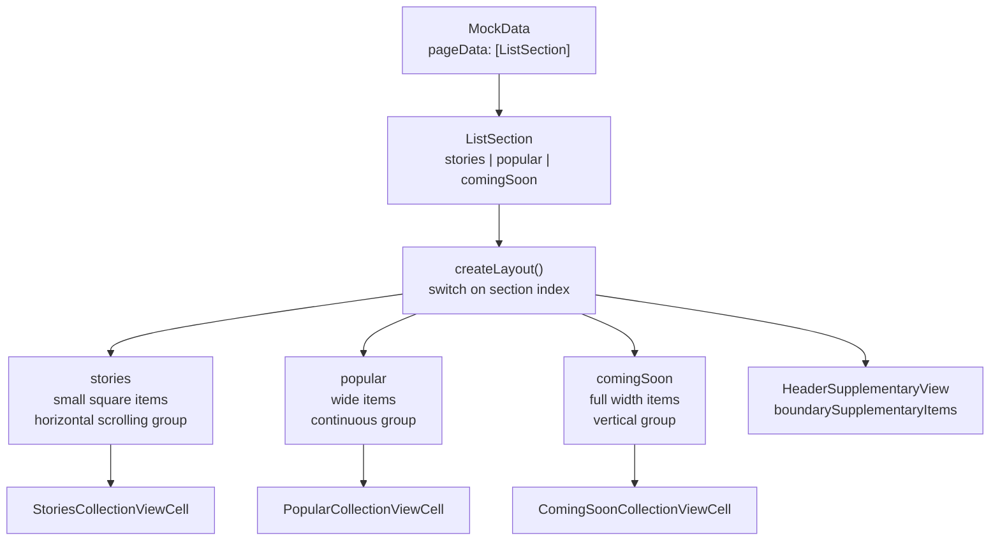

# Compositional Layout

*One collection view rendering several different section layouts, driven by a data model.*

    

## Overview

A discovery screen with a horizontally scrolling stories row, a popular grid and a coming soon
carousel. Before `UICollectionViewCompositionalLayout` this needed either three collection views or a
custom layout subclass. Here it is one collection view whose layout is chosen per section.

## How a section is described



Each branch builds an `NSCollectionLayoutItem`, wraps it in a group with its own size and scrolling
behaviour, and returns a section. The data model decides which branch runs, so adding a fourth
section means adding a case, not restructuring the screen.

## Implementation notes

- **Item, group, section.** The three nesting levels are what make the API expressive. An item is one
  cell, a group arranges items, a section arranges groups and owns the scroll behaviour.
- **Fractional and absolute sizing together.** Widths are expressed as a fraction of the container
  while heights are absolute, which is what keeps the layout correct across device sizes.
- **Headers as boundary items.** `HeaderSupplementaryView` is attached to the section rather than
  faked with a first cell, so it pins and scrolls the way a header should.
- **The model drives the layout.** `ListSection` and `ListItem` are plain types with no UIKit
  knowledge, so the same data could feed a different presentation.

## Project structure

```
CompositionalLayout/
├── Models/         ListSection, ListItem, MockData
├── Cells/          StoriesCollectionViewCell, PopularCollectionViewCell,
│                   ComingSoonCollectionViewCell, HeaderSupplementaryView
└── ViewController/ layout construction and data source
```

## Requirements

Xcode 15 or later, iOS 17.5 or later. No external dependencies.
